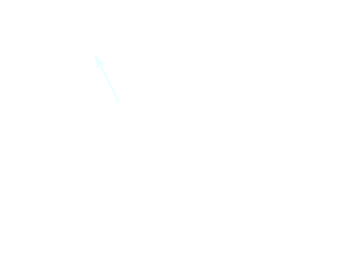

# Event Graph

The event graph represents sequential events in an asynchronous environment.

Events can form small forks which should be quickly reconciled as new nodes are
added to the structure and pull them in.

Ties are broken using the timestamps inside the events.

The main purpose of the graph is *synchronization*. This allows nodes in the network
maintain a fully synced store of objects. How those objects are interpreted is up
to the application.

We add a little more information about the objects which is that they are events
with a timestamp, which allows our algorithm to be more intelligent.

Each node is read-only and this is an append-only data structure. However the
application may wish to prune old data from the store to conserve memory.

## Synchronization

Nodes in the event graph are active, whereas nodes not yet in the graph are orphans.

When node A receives an event from node B, it will check whether all parents are in the
active pool. If there are missing parents then:

1. Check whether the missing parents exist in the orphans pool.
    1. If they have missing parents (they should), then request their missing parent events
       from node B.
2. If the missing parents are not in the orphans pool:
    1. Add this event to the orphans pool.
    2. Request the missing parent events from node B.

Once a node is successfully added to the active pool, and linked in the event graph, then
we call `reorganize()`. This function loops through all the orphans, and tries to relink
them with the active pool. If there are any missing parents, then they are added back to
the orphan pool.

## Creating an Event

In this example A creates a new event. Since the event is new, it is impossible for
any nodes in the network to possess it, so A does not need to send an `inv`.

1. A creates a new event.
2. A sends `event` to $B_1, \dots, B_n$
3. For each $B_i$ in $\{B_1, \dots, B_n\}$:
    1. Create an `inv` representing the event.
    2. Broadcast to all connected nodes `p2p.broadcast(inv)`.
4. A waits for 3 nodes to respond back with the `inv` confirming they received it.
5. Until A receives the `inv` confirms, it will wait for 1 minute and then
   resend the `event` message.

Upon receiving an `inv`:

1. Check if we already have the event. If not then reply back with `getevent`.
2. The node receives `getevent`, and sends `event` back.

So in this diagram, A will send `event` to $B_1, \dots, B_6$. Each $B_i$ will respond
back to A with `inv`, and A will stop sending `event`. Each one of $C_1, \dots, C_3$
also receive `inv`, and since they don't have the event, they will send back to $B_3$,
a `getevent` message. $B_3$ will send them the `event`.
