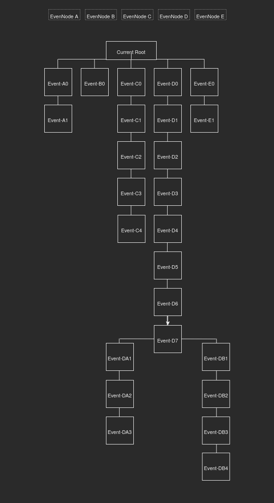

# Structures 

## EventId

Hash of `Event` 

	type EventId = [u8; 32];	

## EventAction 

The `Event` could have many actions according to the underlying data.

	enum EventAction { ... };	

### Actions types

#### Privmsg 

| Description 	| Data Type   	| Comments																	|
|-------------- |-------------- | ------------------------------------------------------------------------- |
| nickname    	| String		| The nickname for the sender (must be less than 32 chars) 					|
| target      	| String		| The target for the `Privmsg` (recipient) 				 					|
| message     	| String		| The `Privmsg`'s content 				 									|

## Event

| Description            | Data Type      | Comments                    |
|----------------------- | -------------- | --------------------------- |
| previous_event_hash    | `EventId` 	  | Hash of the previous `Event`|
| Action     			 | `EventAction`  | `Event`'s action 			|
| Timestamp     		 | u64  		  | `Event`'s timestamp 		|
| read_confirms			 | u8	 		  | A confirmation counter 	    |

## EventNode

| Description    | Data Type      		  | Comments                    			 			  |
|--------------- | ---------------------- | ----------------------------------------------------- |
| parent    	 | Option<`EventId`> 	  | Only current root has this set to None   			  |
| Event     	 | `Event`  			  | The `Event` itself 					       			  |
| Children     	 | Vec<`EventId`>  	      | The `Event`s which has parent as this `Event` hash    |

## Model 

The `Model` consist of chains(`EventNodes`) structured as a tree, each chain has Event-based
list. To maintain strict order in chain, Each `Event` dependent on the hash of the previous `Event`. 
All the chains share a root `Event` to preserve the tree structure. 

| Description   | Data Type      		  		   | Comments                      |
|-------------- | -------------------------------- | ----------------------------- |
| current_root  | `EventId` 	  		  		   | The root `Event` for the tree |
| orphans       | HashMap<`EventId`, `Event`>  	   | Recently added `Event`s 	   |
| event_map     | HashMap<`EventId`, `EventNode`>  | The actual tree  		 	   |

## View 

The `View` asking `Model` for new `Event`s, then dispatching these `Event`s to the clients. 

The `Event`s in `View` are sorted according to the timestamp attached to each `Event`.

| Description   | Data Type      	   | Comments                    					|
|-------------- | -------------------- | ---------------------------------------------- |
| seen  		| HashSet<`EventId`>   | A list of `Event`s have imported from Model	|

# Architecture 

Tau using Model–view software architecture. All the operations, main data structures, 
and handling messages from network protocol, happen in the `Model` side. 
While keeping the `View` independent of the `Model` and focusing on getting update 
from it continuously.

## Add new Event

On receiving new `Event` from the network protocol, the `Event` add to the
orphans list. 

`Event` from orphans list add to chains according to its ancestor. 

For example, in the <em> Example1 </em> below, An `Event` add to the first chain if
its previous hash is Event-A1

## Remove old chains 

	TODO

## Update the root 

	TODO

Example1

Example2

