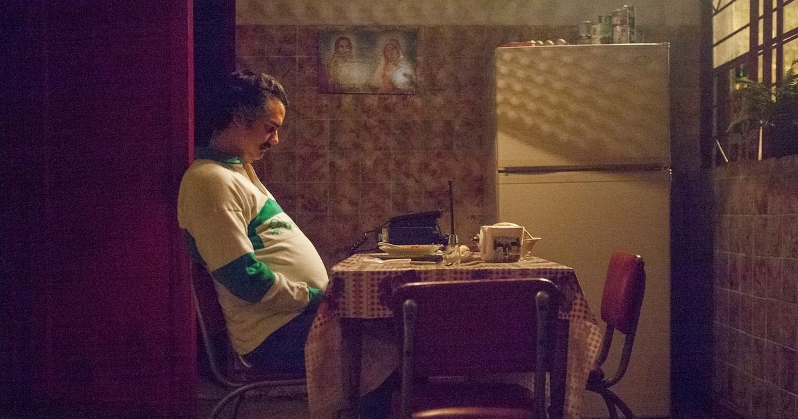

# Atomic Swaps

In order to do an atomic swap with someone, you will
first have to come to consensus on what tokens you wish to
swap. For example purposes, let's say you want to swap `40`
`WCKD` (which is the balance you should have left over after
doing the above payment) for your counterparty's `20` `MLDY`.
For this tautorial the counterparty is yourself.

To protect your anonymity from the counterparty, the swap can only
send entire coins. To create a smaller coin denomination, send
yourself the amount you want to swap. Then check you have a spendable
coin to swap with:

```
$ ./drk wallet --coins
```

You'll have to initiate the swap and build your half of the swap tx:

```
$ ./drk otc init -v 40.0:20.0 -t WCKD:MLDY > half_swap
```

Then you can send this `half_swap` file to your counterparty and they
can create the other half by running:

```
$ ./drk otc join < half_swap > full_swap
```

They will sign the full_swap file and send it back to you. Finally,
to make the swap transaction valid, you need so sign it as well,
and broadcast it:

```
$ ./drk otc sign < full_swap > signed_swap
$ ./drk broadcast < signed_swap
```

On success, you should see a transaction ID. This transaction will now
also be in the mempool, so you should wait again until it's finalized.



After a while you should see the change in balances in your wallet:

```
$ ./drk wallet --balance
```

If you see your counterparty's tokens, that means the swap was
successful.  In case you still see your old tokens, that could mean
that the swap transaction has not yet been finalized.
